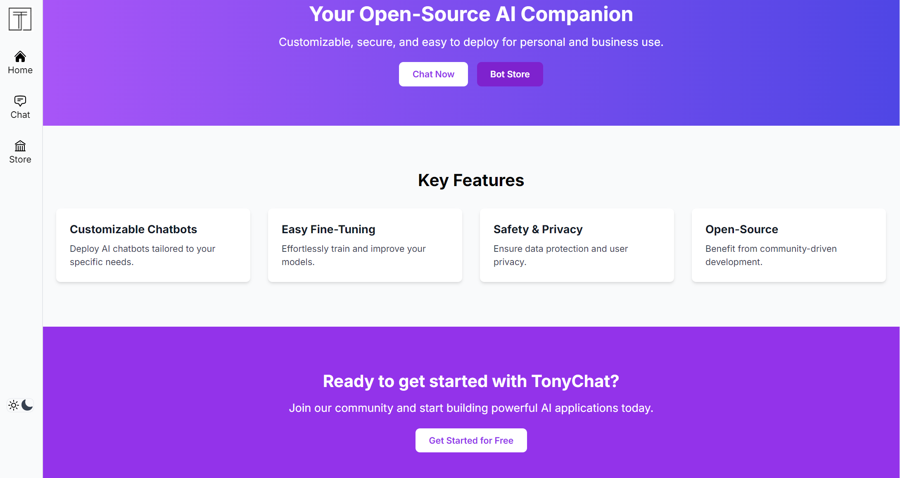

# Tonychat
**TonyChat is a open-source multifunctional Chatbot, which you can use for your personal and business purpose safely. It supports customized chatbot deploy, easy fine tuning your models, safety and privacy. The platform is designed to make it easy for anyone to find, share, and use prompts to develop AI applications.**



[](https://securityscorecards.dev/viewer/?uri=github.comStan370/TonyChat)

## Getting Started

Frontend: React, TypeScript, Tailwind CSS
Backend: Node.js, Express.js
AI Integration: OpenAI API

First, run the development server:

```bash
npm run dev
# or
yarn dev
# or
pnpm dev
# or
bun dev
```

Before starting development, you must create a new `.env.local` file at project root, and place your api key into it:

Open [http://localhost:3000](http://localhost:3000) with your browser to see the result.

You can start editing the page by modifying `app/page.tsx`. The page auto-updates as you edit the file.
This project uses [`next/font`](https://nextjs.org/docs/basic-features/font-optimization) to automatically optimize and load Inter, a custom Google Font.

## Features

1. **Modular Architecture**: The Chatbot component is designed to be modular, allowing users to easily switch between running the chatbot locally or on a server.
2. **Agent Management**: The component allows users to specify a unique identifier for the chatbot agent (`agentId`) and provides an interface for initializing and communicating with the agent.
3. **Conversation Management**: The component manages the conversation state, including the conversation ID and messages.
4. **Message Handling**: The component handles user input and sends it to the chatbot agent, either locally or on the server. It also displays the chatbot's response in the conversation window.
5. **Local Mode**: The component provides an option to run the chatbot locally, allowing users to test and develop their chatbot agents without relying on a server.


## Deploy on Vercel

The easiest way to deploy your Next.js app is to use the [Vercel Platform](https://vercel.com/new?utm_medium=default-template&filter=next.js&utm_source=create-next-app&utm_campaign=create-next-app-readme) from the creators of Next.js.

Check out our [Next.js deployment documentation](https://nextjs.org/docs/deployment) for more details.

## RAG Knowledgebase Integration

### Running the RAG Microservice

1. Install Python dependencies:
   ```sh
   pip install fastapi uvicorn langchain openai faiss-cpu
   ```
2. Start the RAG service:
   ```sh
   uvicorn rag_service:app --reload --port 8001
   ```
   This loads the knowledgebase from `docs/tech` and serves a `/rag/query` endpoint.

### Updating the Knowledgebase
- Edit or replace the `docs/tech` file with your new knowledge content.
- Restart the RAG service to reload the knowledgebase.

### Querying from the Frontend
- Use the `/api/rag` endpoint in your Next.js app to send user queries and receive answers/context from the RAG service.
